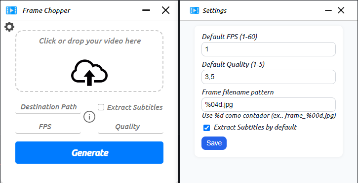

<h1 align="center">Frame Chopper</h1>

<div align="center">
  
</div>

## Description

<h3 align="center">
  Frame Chopper is a graphical interface for extracting frames from video files<br>with the ability to extract subtitles and configure FPS and quality settings.
</h3>

## Building from Source

<details>
  <summary>Click to expand</summary>

### Prerequisites

Before you start, make sure you have the following installed on your system:

- **Node.js** (version 14 or higher recommended)
- **npm** (comes with Node.js) or **yarn**
- **Git** (to clone the repository)
- **FFmpeg** - Required for video processing. The application needs FFmpeg to be installed and available in your system PATH.

#### FFmpeg Installation Instructions

You can install FFmpeg using the following methods or search for your distribution's package manager:

**Windows**:
```bash
winget install --id=Gyan.FFmpeg -e
```

**macOS**:
```bash
brew install ffmpeg
```

**Linux**:
```bash
sudo apt install ffmpeg
```

After installation, verify FFmpeg is accessible by running `ffmpeg -version` in your terminal. If you get an error, make sure FFmpeg is added to your system PATH environment variable.

### Step-by-Step Instructions

**Step 1:** Clone the repository

Open your terminal/command prompt and run:
```bash
git clone https://github.com/JavaRaf/Frame-Chopper.git
cd Frame-Chopper
```

**Step 2:** Install dependencies

Install all required packages using npm:
```bash
npm install
```

**Step 3:** Build the application

To create a distributable version of the app:
```bash
npm run build
```

This command uses `electron-builder` to package the application. The built files will be created in the `dist` folder.

</details>

## App Settings

<details>
  <summary>Click to expand</summary>

The settings screen is located in the upper right corner of the main window. In this screen, you can change the default application settings.

### FPS (Frames Per Second)

FPS defines how many frames will be extracted per second. The default is **3.5 frames per second**, meaning it extracts 3.5 frames per second.

You can also change the FPS to an integer value, for example: `2`, `3`, `4`, etc. frames per second.

### Frame Naming Pattern

The naming pattern defines how frame files will be named. The pattern uses the `%04d` syntax to represent a 4-digit numeric sequence.

**Default naming pattern**: `%04d.jpg`

**Examples of custom patterns**:
- `frame_%02d.jpg` - 2-digit sequence: `frame_1.jpg`, `frame_2.jpg`, `frame_3.jpg`, etc.
- `frame_%04d.jpg` - 4-digit sequence: `frame_0001.jpg`, `frame_0002.jpg`, `frame_0003.jpg`, etc.
- `%04d.jpg` - only numbered frames without prefix: `0001.jpg`, `0002.jpg`, `0003.jpg`, etc.


The output format is defined by the file extension, for example: `jpg`, `png`, `webp` (depends on FFmpeg support).

### Extract Subtitles

This option allows you to extract subtitles from the video, if the input file contains embedded subtitles.

> **Example**: Videos in MKV format often contain subtitles that can be extracted.

</details>

## Download

Download the latest release from the [Frame Chopper releases page](https://github.com/JavaRaf/Frame-Chopper/releases).

> **Note:** Remember to install FFmpeg before using the app.

**Available formats:**
- **Windows**: `.exe` installer
- **macOS**: `.dmg` disk image
- **Linux**: `.AppImage`
