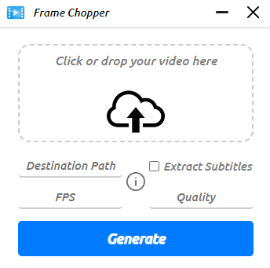

<h1 align="center">🎥 Frame Chopper</h1>

<div align="center">
  
</div>

Frame Chopper is a graphical interface for generating frames from an input video, offering features to extract frames and subtitles with customizable settings.

## 📥 Download Frame Chopper

- [Download Frame Chopper setup-1.0.1.exe](https://github.com/JavaRaf/Frame-Chopper/releases/tag/v1.0.1) (for Windows)

## Install FFmpeg

- Open terminal with administrator privileges, then run the following command: 
  ```bash
  iwr -useb get.scoop.sh | iex

- After installetion, you can run:
  ```bash
  scoop install ffmpeg

- To check if FFmpeg is installed, run:
  ```bash
  ffmpeg -version
  ```


## 🛠️ Usage

1. Download and run [FrameChopper](https://github.com/JavaRaf/Frame-Chopper/releases/tag/v1.0.1) (Windows).
3. Click the input area or drag and drop a video file.
4. Set the desired settings:
   - **Destination Path**: Choose where the frames will be saved. If the folder does not exist, a new one will be created.
   - **FPS**: Set the number of frames per second to extract (default: 2).
   - **Quality**: Define the quality of the extracted frames (1 is the best, 5 is the lowest).
   - **Extract Subtitles**: Check this option if you want to extract English subtitles from the video.

## ✨ Used technologies

- [Html, css, js](https://www.w3schools.com/html/html5_video.asp) - Frontend
- [Electron](https://www.electronjs.org) - Backend
- [FFmpeg](https://ffmpeg.org) - The video processing tool.


Enjoy cutting frames with **Frame Chopper**! 🚀
